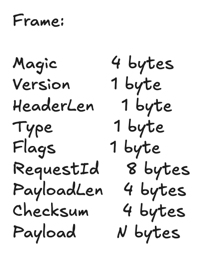
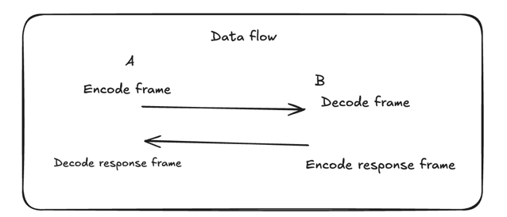

# Frames

## Purpose

Frames are used to transport data in a structured way and with metadata.

## Design

## Responsibilities
TODO: Explain responsibility of each field

## Data Flow
Data flow is pretty standard, nothing too fancy. 
Response packets arent ack, they are usually dictating that the request executed with x result.

## Important Decisions

The number of bytes allocated all have a signification. 
- Magic number : 4 bytes for distinction from other protocols
- Version,headerLen 1 byte is self explanatory
- Type and flags 1 byte so we can have few possibilities and extension possible. 
- RequestId here is really big because we either 1) dont want collision if we generate ids 2) allow incrementation for a lot of packets
- payload length is 4 bytes. Here we have a max size of 16mb for payloads so 4 bytes is enough of a number to cover that
- checksum 4 bytes is standard CRC32
- payload is n bytes, but max 16mb

TODO: Continue doc

## Limitations

## Future Improvements